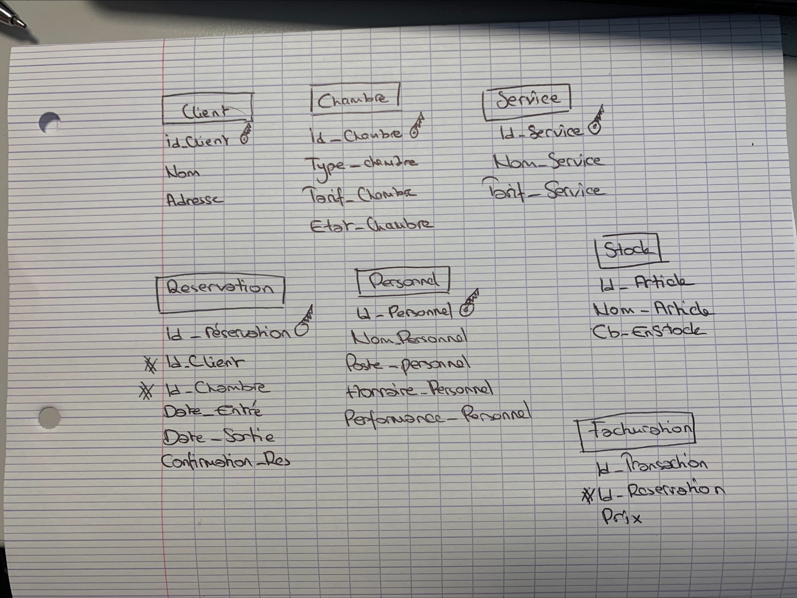

EXAMENS MDD 

QUESTION 3: Quelles sont les etapes prealables a la creation du MCD ? Creez le/les documents necessaires.

Voici;


En plus complet fait avec drawio


```SQL

CREATE TABLE Client (
    Id_Client INT PRIMARY KEY,
    Nom_Client VARCHAR(50),
    Adresse_Client VARCHAR(50),
);

CREATE TABLE Chambre (
    Id_Chambre INT PRIMARY KEY,
    Type_Chambre VARCHAR(30),
    Tarif_Chambre DECIMAL(5, 2),
    Etat_Chambre VARCHAR(10)
);

CREATE TABLE Reservation (
    id_Reservation INT PRIMARY KEY,
    idClient INT,
    Id_Chambre INT,
    Date_Entrer DATE,
    Date_Sortie DATE,
    Confirmation_Reservation VARCHAR(3),
    FOREIGN KEY (Id_Client) REFERENCES Client(Id_Client),
    FOREIGN KEY (Id_Chambre) REFERENCES Chambre(Id_Chambre)
);

CREATE TABLE Service (
    Id_Service INT PRIMARY KEY,
    Nom_Service VARCHAR(50),
    Tarif_Service DECIMAL(5, 2)
);

CREATE TABLE Personnel (
    Id_Personnel INT PRIMARY KEY,
    Nom_Personnel VARCHAR(30),
    Fontion_Personnel VARCHAR(30),
    Horaires_Personnel VARCHAR(30),
    Formation_Personnel VARCHAR(30),
    Performance_Personnel VARCHAR(30)
);
CREATE TABLE Article (
    Id_Article INT PRIMARY KEY,
    Nom_Article VARCHAR(30),
    Nombre_enStock INT
);

CREATE TABLE Facturation (
    Id_Transaction INT PRIMARY KEY,
    Id_Reservation INT,
    Prix_Facture DECIMAL(5, 2),
    dateTransaction DATE,
    FOREIGN KEY (Id_Reservation) REFERENCES Reservation(Id_Reservation)
);


